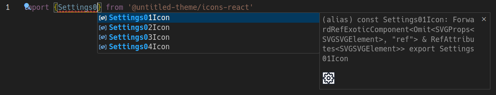

# @untitled-theme/icons-solid

[Untitled UI](<https://www.figma.com/file/5OtZ9gq2jAPCYkmVI2Dd8e/%E2%9D%96-PREVIEW-%E2%9D%96-Untitled-UI-%E2%80%93-PRO-VARIABLES-(v4.0)?type=design&node-id=3463-407484&mode=design&t=oOV4Ezg1JTNhN3ec-0>) icons for Solid.




## Installation

```bash
npm install @untitled-theme/icons-solid
```

## Usage

```jsx
import {Rocket01Icon} from '@untitled-theme/icons-solid';

function Component() {
  return <Rocket01Icon />;
}
```

or

```jsx
import Rocket01Icon from '@untitled-theme/icons-solid/Rocket01Icon';

function Component() {
  return <Rocket01Icon />;
}
```

See all icons [here](https://untitled-theme-docs.vercel.app/icons)
